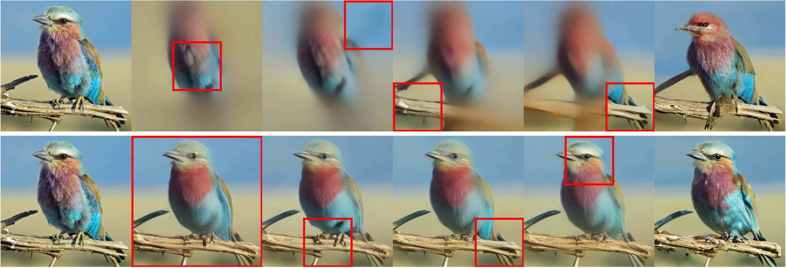

<h1 align="center">
  <br>
	Communication-Inspired Tokenization for Structured Image Representations
  <br>
</h1>
  <p align="center">
    <a href="https://araachie.github.io">Aram Davtyan</a> •
    <a href="https://www.cvg.unibe.ch/people/sahin">Yusuf Sahin</a> •
    <a href="https://people.epfl.ch/yasaman.haghighi?lang=en">Yasaman Haghighi</a> •
    <a href="https://www.cvg.unibe.ch/people/stapf">Sebastian Stapf</a> •
    <a href="https://www.cvg.unibe.ch/people/acuaviva">Pablo Acuaviva</a> •
    <a href="https://people.epfl.ch/alexandre.alahi?lang=en">Alexandre Alahi</a> •
    <a href="https://www.cvg.unibe.ch/people/favaro">Paolo Favaro</a>
  </p>
<h4 align="center">Official repository of the paper</h4>

<h4 align="center"><a href="https://araachie.github.io/comit/">Website</a> • <a href="https://arxiv.org">Paper</a>

<p float="left">
  
</p>

#
> **Abstract:** *Discrete image tokenizers have emerged as a key component of modern vision and multimodal systems, providing a sequential interface for transformer-based architectures. However, most existing approaches remain primarily optimized for reconstruction and compression, often yielding tokens that capture local texture rather than object-level semantic structure.
>Inspired by the incremental and compositional nature of human communication, we introduce COMmunication inspired Tokenization (COMiT), a novel framework for learning structured discrete visual token sequences. COMiT constructs a latent message within a fixed token budget by iteratively observing localized image crops and recurrently updating its discrete representation. At each step, the model integrates new visual information while refining and reorganizing the existing token sequence. After several encoding iterations, the final message conditions a flow-matching decoder that reconstructs the full image. Both encoding and decoding are implemented within a single transformer model and trained end-to-end using a combination of flow-matching reconstruction and semantic representation alignment losses.
>Our experiments demonstrate that while semantic alignment provides grounding, the proposed attentive sequential tokenization is critical for inducing interpretable, object-centric token structure and substantially improving compositional generalization and relational reasoning over prior methods.*

## Installation

1. Clone the repository and navigate to the root directory:

```
git clone https://github.com/Araachie/comit.git
cd comit
```

2. Create a new conda environment and install all the dependencies:

```
conda create -n comit python==3.11 -y
conda activate comit
pip install -e .
```

3. [Optional] To enable jupyter instead of the last command, run:

```
pip install -e ".[notebook]"
python -m ipykernel install --user --name comit --display-name "Python (comit)"
```


## Model Zoo

We share the weights of the pretrained COMiT variants in three sizes.

<table style="margin:auto">
    <thead>
        <tr>
          <th>Model name</th>
          <th>Layers</th>
          <th>Model size</th>
          <th>Dataset</th>
          <th>Hugging face hub</th>
          <th>Model weights</th>
        </tr>
    </thead>
    <tbody>
        <tr>
            <td>COMiT-B</td>
            <td>12</td>
            <td>174M</td>
            <td>ImageNet1k</td>
            <td><a href="https://huggingface.co/cvg-unibe/comit-b">cvg-unibe/comit-b</a></td>
            <td><a href="https://huggingface.co/cvg-unibe/comit-b/blob/main/model.safetensors">download</a></td>
        </tr>
        <tr>
            <td>COMiT-L</td>
            <td>24</td>
            <td>610M</td>
            <td>ImageNet1k</td>
            <td><a href="https://huggingface.co/cvg-unibe/comit-l">cvg-unibe/comit-l</a></td>
            <td><a href="https://huggingface.co/cvg-unibe/comit-l/blob/main/model.safetensors">download</a></td>
        </tr>
        <tr>
            <td>COMiT-XL</td>
            <td>28</td>
            <td>900M</td>
            <td>ImageNet1k</td>
            <td><a href="https://huggingface.co/cvg-unibe/comit-xl">cvg-unibe/comit-xl</a></td>
            <td><a href="https://huggingface.co/cvg-unibe/comit-xl/blob/main/model.safetensors">download</a></td>
        </tr>
    </tbody>
</table>

## Usage

For convenience, we have prepared a demo Jupyter notebook at `./notebooks/demo.ipynb` that shows how to use COMiT. We recommend starting with it. Below are some examples of using COMiT to quickly get started.

Example usage, downloading `COMiT-XL` from the Hugging Face Hub:

```
from comit import COMiT

model = COMiT.from_pretrained('cvg-unibe/comit-xl')
model.eval().to(device)
```

With a pretrained COMiT model images can be encoded into token sequences as follows:

```
with torch.no_grad():
  token_dict = model.tokenize(
      batch,
      global_crop=False,  # Whether to use the global crop as the first observation
      order="adaptive",  # One of ["raster_scan", "random", "adaptive"] or a list of crop indices
      num_crops=3,  # Used to truncate the list of crops to embed
  )
```

By default the tokenization pipeline returns a list of 256 6-dimensional tokens. If token indices are needed instead, they can be obtained via:

```
token_ids = model.quantizer.codes_to_indices(token_dict["msgs"])
```

To visually probe the information in the token sequences, one can decode the tokens back into images:

```
with torch.no_grad():
  detoken_dict = model.detokenize(
      msgs=token_dict["msgs"],
      offsets=token_dict["offsets"],
      num_steps=10,  # Number of denoising steps
      odesolver="euler",  # The numerical velocity field integration method
      cfg_weight=7.5,  # CFG strength
  )
```

For convenience we also provide the `reconstruct` method that pipelines `tokenize` and `detokenize` into a single call:

```
with torch.no_grad():
  rec_dict = model.reconstruct(
      batch,
      global_crop=False,
      order="adaptive",
      num_crops=3,
      num_steps=10,
      odesolver="euler",
      cfg_weight=7.5,
  )
```

## Citation

If you find this repository helpful, please consider citing our work:

```
@misc{
  davtyan2026comit,
  title={Communication-Inspired Tokenization for Structured Image Representations},
  author={Aram Davtyan and Yusuf Sahin and Yasaman Haghighi and Sebastian Stapf and 
    Pablo Acuaviva and Alexandre Alahi and Paolo Favaro},
  year={2026},
}
```